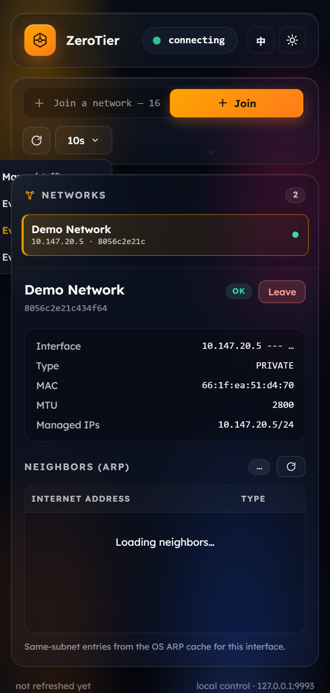

# ZeroTier Desktop

> ⚠️ **Unofficial community client.** This project is **not affiliated with, endorsed by, or sponsored by ZeroTier, Inc.** "ZeroTier" is a trademark of ZeroTier, Inc. This is an independent, open-source GUI for the *local* ZeroTier service.

A small, fast, good-looking **Electron** desktop client for the local
[`zerotier-one`](https://www.zerotier.com/) service. It shows your node status,
your joined networks, and the same-subnet neighbors of each network — and lets you
join / leave networks. Built to be quiet (no runtime errors), pretty, and minimal.


---

## ✨ Features

- **Node status** — address, online state, version, with a live pulsing indicator.
- **Networks** — selectable list; click one to open its detail.
- **Per-network neighbors (ARP)** — for the selected network's interface, lists the
  same-subnet peers (Internet address · physical address · type) read live from the
  OS ARP cache. Broadcast/​network/​multicast entries are filtered out.
- **Join / leave** networks by 16-hex network ID.
- **Light / dark theme** toggle (orange-accented dark + warm light) — remembered.
- **English / 中文** language switch — remembered.
- **Custom refresh cadence** — manual, or auto every 5 / 10 / 30 seconds.
- **GSAP animations** across every component, **SVG icons only** (no emoji),
  **responsive** layout, and a **sandboxed** renderer (the auth token never reaches
  the UI).

 

---

## 📦 Requirements

- **Node.js 18+** (developed on Node 24)
- The **ZeroTier service** (`zerotier-one`) installed and running.
  - Windows: `C:\Program Files\ZeroTier\One\`, token at `C:\ProgramData\ZeroTier\One\authtoken.secret`
  - macOS: `/Library/Application Support/ZeroTier/One/`
  - Linux: `/var/lib/zerotier-one/`

---

## 🚀 Getting started

```bash
git clone https://github.com/<owner>/zerotier-desktop.git
cd zerotier-desktop
npm install
npm start          # launch the app
```

> **GitHub blocked on your network?** The Electron binary download can fail.
> Point npm at a mirror via `.npmrc` (not committed) or an env var:
> `ELECTRON_MIRROR=https://cdn.npmmirror.com/binaries/electron/ npm install`

---

## 🧪 Test & self-check

```bash
npm test            # non-GUI test: exercises the ZeroTier API client against the live service
npm run selftest    # boots the full app, renders real data, prints a report, exits (non-zero on error)
```

### Preview the UI without a service

The renderer has a built-in **mock-data fallback**, so `src/renderer/index.html`
renders standalone (e.g. opened in a browser) with demo data. A Playwright capture
tool is included for screenshotting all theme/language states:

```bash
npx playwright install chromium
node tools/capture-preview.js .preview
```

---

## 🛠 Build / package (.exe)

```bash
npm run dist          # Windows NSIS installer  → dist/
npm run dist:portable # single-file portable    → dist/
```

Both targets are produced with one command: `npx electron-builder --win nsis portable`.
The executables are **unsigned** and use the default Electron icon (set
`build.win.icon` + a code-signing certificate to change that).

---

## 🔧 How it works

### Talking to ZeroTier
The local control API is **plain HTTP** on `127.0.0.1:9993` (not HTTPS), authenticated
via the `X-ZT1-Auth` header with the contents of the service's `authtoken.secret`.

| Endpoint | Purpose |
| --- | --- |
| `GET /status` | node address, online, version |
| `GET /network` | joined networks (id, name, status, IPs, mac, mtu) |
| `POST /network/<id>` | join a network |
| `DELETE /network/<id>` | leave a network |
| `GET /peer` | VL1 peers |

### Same-subnet neighbors
The ZeroTier API only exposes VL1 peers (no per-network L3 neighbors). To show a
network's members, the app reads the **OS ARP cache** for that interface
(`arp -a -N <ip>` on Windows), decodes it (GBK, so localized `静态/动态` types are
parsed correctly), and filters to the network's subnet — excluding the subnet
broadcast (`.255`) and network (`.0`) addresses.

---

## 🔒 Security model

- Renderer is **sandboxed**: `contextIsolation: true`, `nodeIntegration: false`,
  `sandbox: true`. It can only call the small whitelisted API exposed on
  `window.zerotier`.
- The **auth token and all network access live in the main process** and never
  reach the renderer.
- Every API call resolves to `{ ok, data?, error? }` instead of throwing, and every
  IPC handler is wrapped in `try/catch` — a failed poll or an offline service shows
  a clean status message instead of crashing.

---

## 🌍 Internationalization & theming

- **Languages:** English / 中文. Strings live in `STRINGS` in
  [`src/renderer/app.js`](src/renderer/app.js); add a locale by adding a key set.
- **Themes:** dark (default) and light, driven by CSS variables under
  `:root[data-theme="light"]` in [`src/renderer/styles.css`](src/renderer/styles.css).
- Both preferences (plus refresh interval) persist in `localStorage`.

---

## 📁 Project structure

```
src/
  main.js          Electron main: window, IPC handlers, menu removal, --selftest
  preload.js       contextBridge — the only renderer↔main bridge (sandboxed)
  zt-client.js     ZeroTier HTTP client (every method resolves {ok,…}, never throws)
  arp.js           OS ARP-table reader + subnet/broadcast filtering
  renderer/
    index.html     UI structure (data-i18n attributes)
    styles.css     themable dark/light, master-detail, responsive
    app.js         renderer logic: list/detail/ARP, i18n, theme, interval, GSAP
    fonts/         Lexend (bundled, OFL) — ZeroTier's web font
    vendor/        GSAP (bundled)
tools/
  capture-preview.js   Playwright screenshot harness (all states)
test/
  zt-client.test.js    non-GUI API client test
```

---

## 📜 Credits & third-party licenses

This project's own code is **MIT** (see [LICENSE](LICENSE)). It bundles:

- [**Electron**](https://www.electronjs.org/) — MIT
- [**GSAP**](https://gsap.com/) — GreenSock "No Charge" license (free for this free
  client; **not** OSI-approved — swap for CSS animations if you require a 100%
  OSI-licensed stack)
- [**Lexend**](https://fonts.google.com/specimen/Lexend) — SIL Open Font License 1.1
- **ZeroTier®** is a trademark of ZeroTier, Inc. This project is independent and not
  affiliated with ZeroTier.

---

## 🤝 Contributing

Issues and PRs welcome. Keep the "never throw to the UI" contract, prefer SVG icons
over emoji, and run `npm test` + `npm run selftest` before submitting.

---

## 📄 License

MIT © 2026 ZeroTier Desktop contributors
