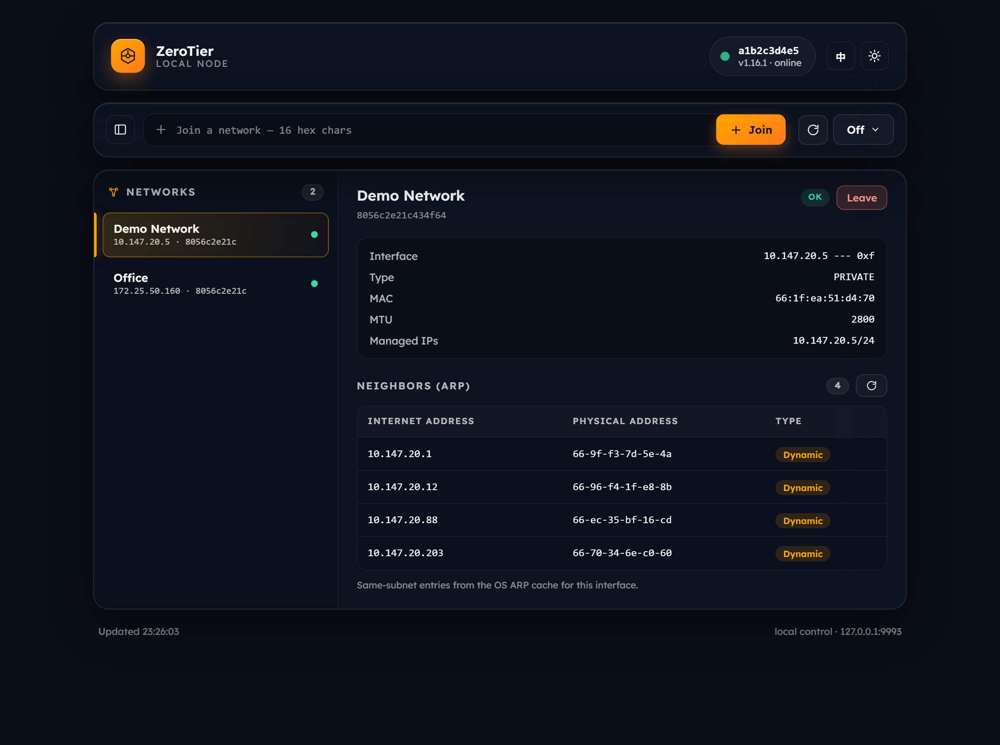
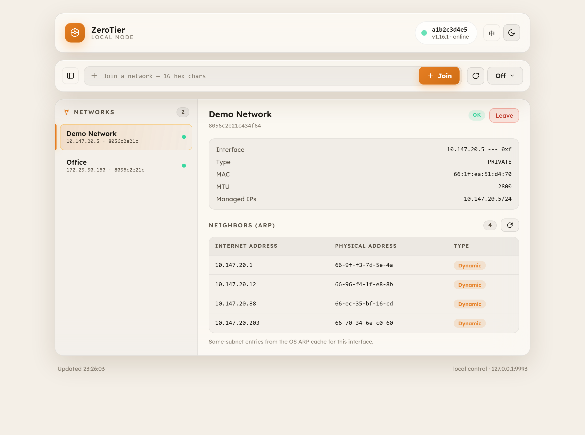

# ZeroTier Desktop

> ⚠️ **Unofficial community client.** Not affiliated with, endorsed by, or sponsored by ZeroTier, Inc. "ZeroTier" is a trademark of ZeroTier, Inc.

A tiny, polished desktop client for the local [`zerotier-one`](https://www.zerotier.com/) service, built with **Tauri 2** (Rust backend + system WebView2 frontend). See your node status, joined networks, and the same-subnet neighbors of each network, and join/leave networks.

**~4 MB binary** (vs ~90 MB for an equivalent Electron app) — it uses the OS's built-in WebView instead of shipping a full browser.



---

## ✨ Features

- **Node status** — address, online state, version, with a live pulsing indicator and **auto-reconnect** (a status heartbeat turns the dot red on disconnect and recovers green automatically; a manual **Reconnect** button is offered while offline).
- **Networks** — collapsible list; click one to open its detail. A sliding amber indicator animates between selections.
- **Per-network neighbors (ARP)** — for the selected network's interface, lists the same-subnet peers (Internet address · physical address · type) read live from the OS ARP cache. Broadcast / network / multicast entries are filtered out.
- **Join / leave** networks by 16-hex network ID.
- **Light / dark theme** toggle (solid colors, remembered).
- **English / 中文** language switch — in-place relabel, never refetches (remembered).
- **Custom refresh cadence** — manual (default), or auto every 5 / 10 / 30 s.
- **GSAP** animations, **SVG icons only** (no emoji), responsive layout.



---

## 📦 Download

Grab the latest installer or portable build from the [**Releases**](../../releases) page.

- **Installer** — `ZeroTier-Desktop_1.0.0_x64-setup.exe` (~2 MB). Installs to *Program Files*; bootstraps the WebView2 runtime if missing.
- **Portable** — `ZeroTier-Desktop-1.0.0-portable.zip`. Unzip and run `ZeroTier Desktop.exe` (keep `WebView2Loader.dll` next to it). Requires the [WebView2 runtime](https://developer.microsoft.com/microsoft-edge/webview2/) (preinstalled on Windows 11).

---

## 🛠 Build from source

> The project path **must not contain spaces** — Tauri's Windows resource compiler (`windres`) breaks on spaces. Clone to e.g. `C:\dev\zerotier-desktop`.

Prerequisites (Windows, no Visual Studio / admin needed):

- **Rust** (GNU target): `winget install Rustlang.Rustup`, then `rustup default stable-x86_64-pc-windows-gnu`
- **MinGW-w64** (provides `dlltool`/`gcc`/`as` for native crate builds): download a [WinLibs](https://winlibs.com/) portable build (POSIX, SEH) and put its `bin` on `PATH`
- **Node.js** 18+ (for the Tauri CLI)
- **WebView2** runtime (present on Windows 11)

```bash
git clone https://github.com/TG-TaiGuan/zerotier-desktop.git
cd zerotier-desktop
npm install
# MinGW bin + cargo must be on PATH, then:
npx tauri build
```

Output: `src-tauri/target/release/zerotier-desktop.exe` (+ `WebView2Loader.dll`), and the NSIS installer under `.../bundle/nsis/`.

> If `crates.io` is unreachable, point cargo at a mirror in `~/.cargo/config.toml`, e.g. `rsproxy.cn` (China).

### Dev / preview

The frontend (`frontend/`) has a mock-data fallback, so `frontend/index.html` renders standalone in a browser with demo data (no service needed). A Playwright capture tool is included for screenshots:

```bash
npx playwright install chromium   # in any project with playwright, or install here
node tools/capture-preview.js .preview   # (capture tool lives in the legacy Electron repo)
```

---

## 🔧 How it works

- **ZeroTier API** — plain HTTP on `127.0.0.1:9993`, authenticated via the `X-ZT1-Auth` header with the service's `authtoken.secret` (auto-detected per platform). Endpoints: `GET /status`, `GET /network`, `POST /network/<id>`, `DELETE /network/<id>`.
- **Same-subnet neighbors** — the ZeroTier API only exposes VL1 peers (no per-network L3 neighbors), so the app reads the OS ARP cache for the selected interface (`arp -a -N <ip>` on Windows), GBK-decodes it (so localized `静态/动态` types parse), and filters to the network's subnet (excluding broadcast `.255` / network `.0`).
- All of this lives in the **Rust backend** (`src-tauri/src/main.rs`) and is exposed to the frontend via Tauri `invoke` commands — every command returns `{ ok, data?, error? }`.

---

## 🔒 Security model

- The frontend runs in the system WebView; it can only call the small whitelisted Tauri commands on `window.__TAURI__.core.invoke`.
- The **auth token and all network/OS access stay in the Rust backend** and never reach the frontend.
- Every command returns `{ ok, ... }` instead of throwing — a failed call or offline service shows a clean status message instead of crashing.

---

## 📁 Project structure

```
src-tauri/
  src/main.rs        Rust backend: ZeroTier HTTP client + ARP reader (mirrors the old JS)
  Cargo.toml         deps: tauri, ureq, encoding_rs, serde_json (release profile = size-optimized)
  tauri.conf.json    window, CSP, bundle config
  icons/             generated app icons
frontend/            the UI (HTML/CSS/JS + bundled GSAP + Lexend), embedded into the binary
  index.html  styles.css  app.js
  vendor/gsap.min.js   fonts/lexend.*
```

---

## 📜 Credits & third-party licenses

Project code: **MIT**. Bundles:

- [**Tauri 2**](https://tauri.app/) — MIT/Apache-2.0
- [**GSAP**](https://gsap.com/) — GreenSock "No Charge" license (free for this free client; not OSI-approved)
- [**Lexend**](https://fonts.google.com/specimen/Lexend) — SIL Open Font License 1.1
- Uses the OS **WebView2** runtime (Microsoft)
- **ZeroTier®** is a trademark of ZeroTier, Inc. This project is independent and not affiliated.

---

## 🤝 Contributing

Issues and PRs welcome. Keep the "never throw to the UI" contract (`{ ok, error }`), prefer SVG icons, and run `cargo test` (live backend tests) before submitting.

## 📄 License

MIT © 2026 ZeroTier Desktop contributors
